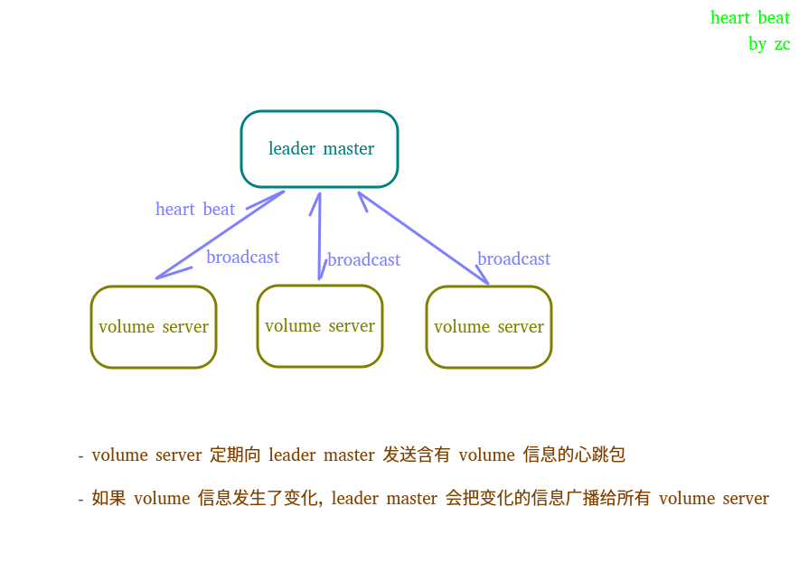

[toc]

# master 节点维护拓扑结构的方式

- 如果有多个 master 节点，则 masters 之间通过 raft 协议选出 leader
- master  节点中的 leader 负责维护 volume servers 节点信息以及所有位于集群上的 volumes 的信息
- master 节点中的非 leader 节点只负责信息的转发和请求的重定向， 不会对信息进行处理和维护
- volume server 不仅维护了位于自身节点上的 volume 的信息，同时也维护了远程 volume server 上的部分信息
- 所有的连接到非 leader 的 master 节点的 volume server 最终会和 leader 建立连接，并向 leader master 发送心跳信息, 其中心跳信息中包含了 volume server 上的 volume 信息
- leader master 收到心跳信息之后，如果 volume 信息发生了变化，会把 volume 信息广播到所有 voluem server 上去

# Volume 节点存储数据的方式

## Concepts

- needle, 原义针，代表二进制格式的结构化的小文件，是数据在文件系统上的最终存储形式，由固定长度的 header 和不固定长度的 body 组成， 其中 header 中存储有 body 的长度
- volume, 卷， 对应文件系统中真正存在的一个文件（.dat）， 它是很多个 needle 的集合， 不同的 needle 存储在 volume 的不同位置（offset）
- needle mapper, 顾名思义， 存储了 needle_id 到（needle_id, offset, size）三元组的映射关系， 利用这个三元组配合操作文件指针，可以在O（1） 的时间复杂度找到存储在 volume 中的 needle 文件。同时，这个 mapper 是在启动时，根据 (.idx 或者 .dat) 建立起来的，一旦建立起来就会常驻内存，因此进行mapper的时候无需磁盘操作。
- super block, 直译超级块，每个 volume 中会有一个超级块（占用8 bytes），用来记录 Version， Replica Placement strategy， TTL， Compact times 信息
- store, 每个 volume server 只有一个 store， 用来管理所有位于这个 volume server 上的 volumes

## super block 内存布局

## needle

### 

- 每个 needle 主要有三部分组成， 固定长度的 header 和 不定长度的 body， 以及其他部分
- header 固定 16 bytes， 由3部分组成
  - cookie， 随机生成的序列，用来防止 id 猜测
  - needle id
  - size， 用来标识 body 的长度
- data 为 needle 的数据段
- 其他部分主要包括用来校验等作用的固定长度的字段和 padding，这里 padding 主要为用来对齐到 8 byte

## volume

- 每个 volume 其实是一个 .dat 文件， 它会包含很多的 needle
- mapper <needle_id, offset, size> 其中 needle_id 8 bytes, offset 4 bytes, size 4 bytes, mapper 存在于内存中，用于 needle 在整个 volume 中的文件指针寻址和一次性读出操作，机器重启的时候会从(.idx) 文件 恢复，或者从(.dat) 文件中重建
- 由于 volume 中的 对齐方式为 8 bytes 而且 mapper 中的 offset 为 4 bytes， 所以一个 volume 可寻址（或者叫做索引）的大小为 8 * 2^32 = 32 G

## 读取文件的方式

- 通过 fid 中的卷信息找到对应的卷
- 通过 对应的 mapper 把 fid 映射成 <needle_id, offset, size> 
- 通过 offset 和 size 直接操作文件指针, 利用块读取，一次性读出整个 needle
- 解包 needle 

## 写入文件的方式

- 把原始数据打包成 needle 
- 把 needle 写入 volume 
- 设置 needle 在 volume 中的 mapper 信息

## 更新文件的方式

- 更新本质是在 volume 中追加写入一份新的 needle 文件
- 然后更新 mapper

## 删除文件的方式

- 删除本质是在 volume 中追加写入一份特殊的 needle 文件
- 更新 mapper

## compact 的方式

- compact 主要是通过当前的 volume 生成一个干净的 volume (不含过期和已经删除的 needle 或是被更新过的 needle 的旧的副本)，然后把新的 volume 重命名成当前的 volume 

## TTL of volume and TTL of needle

- 每个 volume 会在它的 super block 中有个 TTL 属性，当请求 master server 进行 assign 时带上ttl参数(例如GET http://localhost:9333/dir/assign?ttl=3m)，则master server 会找出现存的 TTL=3m 的 volume, 如果没有则会创建多个 TTL=3m 的 volumes (默认7个)
- TTL=3m 的 volume 有点儿像是一个会话，当 time.Now() - TimeOfVolumeLastWritten() > TTL + min(0.1*TTL, 10min) 时，意味着最后写入 volume 的文件已经超时，weed 会删除整个 volume
- 当 needle 的 TTL < volume 的 TTL 时，一旦请求了超时的 needle，则返回未找到， 其实 needle 仍然存在于 volume 中

# 相关链接

- [How to use it](./HowToUseSeaweedfs.md)
- [What is seaweedfs](./index.md)

