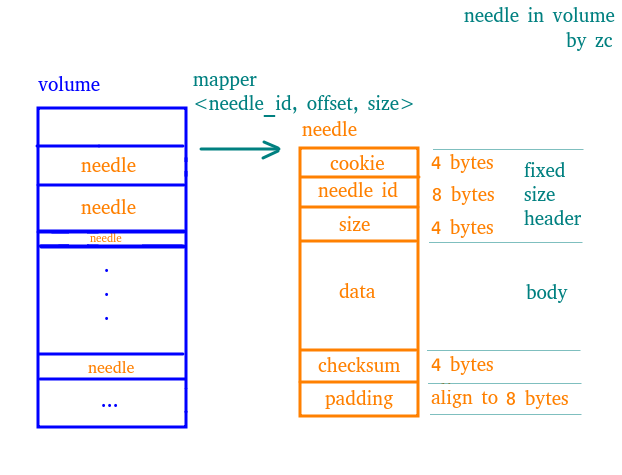

## Welcome to Come Across Seaweedfs

This is a note of seaweedfs, consisting of
- What is seaweedfs
- How to use it
- How it works

[toc]

### Concepts

- needle, 原义针，代表二进制格式的结构化的小文件，是数据在文件系统上的最终存储形式，由固定长度的 header 和不固定长度的 body 组成， 其中 header 中存储有 body 的长度
- volume, 卷， 对应文件系统中真正存在的一个文件（.dat）， 它是很多个 needle 的集合， 不同的 needle 存储在 volume 的不同位置（offset）
- needle mapper, 顾名思义， 存储了 needle_id 到（needle_id, offset, size）三元组的映射关系， 利用这个三元组配合操作文件指针，可以在O（1） 的时间复杂度找到存储在 volume 中的 needle 文件。同时，这个 mapper 是在启动时，根据 (.idx 或者 .dat) 建立起来的，一旦建立起来就会常驻内存，因此进行mapper的时候无需磁盘操作。
- super block, 直译超级块，每个 volume 中会有一个超级块（占用8 bytes），用来记录 Version， Replica Placement strategy， TTL， Compact times 信息
- store, 每个 volume server 只有一个 store， 用来管理所有位于这个 volume server 上的 volumes

### needle && volume

#### needle

- 每个 needle 主要有三部分组成， 固定长度的 header 和 不定长度的 body， 以及其他部分
- header 固定 16 bytes， 由3部分组成
  - cookie， 随机生成的序列，用来防止 id 猜测
  - needle id
  - size， 用来标识 body 的长度
- data 为 needle 的数据段
- 其他部分主要包括用来校验等作用的固定长度的字段和 padding，这里 padding 主要为用来对齐到 8 byte

#### volume

- 每个 volume 其实是一个 .dat 文件， 它会包含很多的 needle
- mapper <needle_id, offset, size> 其中 needle_id 8 bytes, offset 4 bytes, size 4 bytes, mapper 存在于内存中，用于 needle 在整个 volume 中的文件指针寻址和一次性读出操作，机器重启的时候会从(.idx) 文件 恢复，或者从(.dat) 文件中重建
- 由于 volume 中的 对齐方式为 8 bytes 而且 mapper 中的 offset 为 4 bytes， 所以一个 volume 可寻址（或者叫做索引）的大小为 8 * 2^32 = 32 G

#### 写入文件

#### 读取文件

#### 删除文件

#### 更新文件

#### 设置 TTL

#### Compact && Vacuum

### Store

### Filer

### Topology

### Data Center

### Rack

### Data Node

### Master Server

### Volume Server

### Seaweed 的 API

### Seaweed 的搭建

