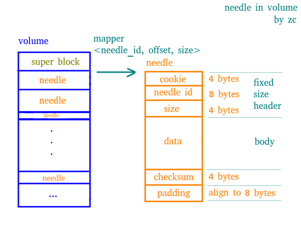

## Welcome to Come Across Seaweedfs

This is a note of seaweedfs, consisting of
- What is seaweedfs
- How to use it
- How it works


[toc]

## seaweed 节点逻辑拓扑图


### master server 节点的功能

#### [master server API](https://github.com/chrislusf/seaweedfs/wiki/Master-Server-API)

- GET (/dir/assign) 写文件前为文件分配 volume server 和 fid
- GET (/dir/lookup) 通过 volume id 查询 volume URL
- GET (/vol/vacuum) 强制进行 gc
- GET (/vol/grow) 提前分配多个 volumes 用以增加并发，每个 volume 为序列化写入
- GET (/col/delete) 删除 collection
- GET (/cluster/status) 查看集群状态
- GET (/dir/status) 查看逻辑拓扑状态

#### master server 的内部功能

- 维护 volume 的信息， 包括 volume 的增加和删除，volume 的大小等
- 定期发送 vacumm 指令给 volume server
- 定期执行一些配置文件中指定的指令

### volume server 节点的功能

#### [volume server API](https://github.com/chrislusf/seaweedfs/wiki/Volume-Server-API)

- POST (/{fid}) 写文件
- DELETE(/{fid}) 删除文件
- GET (/status) 查看 volume 信息
- GET (/{fid}) 读文件

#### volume server 的内部功能

- 定期向 master 发送心跳包，把 volumes 信息发送到 master


## [seaweed 的环境搭建](https://github.com/chrislusf/seaweedfs#example-usage)

```shell
#!/bin/bash

# 第一步
# 下载对应版本的二进制文件(https://github.com/chrislusf/seaweedfs/releases/latest)
# 或者下载源码并进行编译（https://github.com/chrislusf/seaweedfs）

# 第二步
# 启动一个或多个 master server
./weed master

# 第三步
# 启动一个或者多个 volume server
./weed volume -dir="/tmp/data1" -max=5  -mserver="localhost:9333" -port=8080 &
./weed volume -dir="/tmp/data2" -max=10 -mserver="localhost:9333" -port=8081 &
```


## [seaweed API 使用](https://github.com/chrislusf/seaweedfs#example-usage)

### 写文件

1. 向 master server 发起 GET 请求获取 fid 和 volume server 信息（事实上 POST, PUT 请求也可以 ）

   ```shell
   curl http://localhost:9333/dir/assign
   # 请求结果为
   # {"count":1,"fid":"3,01637037d6","url":"127.0.0.1:8080","publicUrl":"localhost:8080"}
   ```

2. 向 volume server 发起 multi-part POST 请求

   ```shell
   curl -F file=@/home/chris/myphoto.jpg http://127.0.0.1:8080/3,01637037d6
   # 请求结果为
   # {"name":"myphoto.jpg","size":43234,"eTag":"1cc0118e"}
   ```

3. 保存 fid 或者直接保存 URL(http://{volume server ip}:{volume server port}/{fid})

**ps :  fid 由三部分组成 {volume id},{real fid}{8字节的cookie用来防止fid猜测}**

### 读文件

1. 根据 fid 向 master server 发起 GET 请求，获取 volume server 信息

   ```shell
   curl http://localhost:9333/dir/lookup?volumeId=3
   # 请求结果为
   # {"volumeId":"3","locations":[{"publicUrl":"localhost:8080","url":"localhost:8080"}]}
   ```

2. 根据 fid 向 volume server 发起 GET 请求，获取文件

   ```shell
   curl http://localhost:8080/3,01637037d6
   ```

### 删除文件

1. 根据 fid 向 master server 发起 GET 请求获取 fid 和 volume server 信息（事实上 POST, PUT 请求也可以 ）

   ```shell
   curl http://localhost:9333/dir/assign
   # 请求结果为
   # {"count":1,"fid":"3,01637037d6","url":"127.0.0.1:8080","publicUrl":"localhost:8080"}
   ```

2. 根据 fid 向 volume server 发起 DELETE 请求

   ```shell
   curl -X DELETE http://127.0.0.1:8080/3,01637037d6
   ```

### 更新文件

1. 根据 fid 向 master server 发起 GET 请求，获取 volume server 信息

   ```shell
   curl http://localhost:9333/dir/lookup?volumeId=3
   # 请求结果为
   # {"volumeId":"3","locations":[{"publicUrl":"localhost:8080","url":"localhost:8080"}]}
   ```


2. 向 volume server 发起 multi-part POST 请求

   ```shell
   curl -F file=@/home/chris/myNEWphoto.jpg http://127.0.0.1:8080/3,01637037d6
   # 请求结果为
   # {"name":"myNEWphoto.jpg","size":43234,"eTag":"1cc0118e"}
   ```

**ps: 更新文件其实就是重新执行一次写文件的第二步，上传新的文件内容**

### 设置 TTL


## Replica

### Data Center


### Rack


### Data Node


## Concepts

- needle, 原义针，代表二进制格式的结构化的小文件，是数据在文件系统上的最终存储形式，由固定长度的 header 和不固定长度的 body 组成， 其中 header 中存储有 body 的长度
- volume, 卷， 对应文件系统中真正存在的一个文件（.dat）， 它是很多个 needle 的集合， 不同的 needle 存储在 volume 的不同位置（offset）
- needle mapper, 顾名思义， 存储了 needle_id 到（needle_id, offset, size）三元组的映射关系， 利用这个三元组配合操作文件指针，可以在O（1） 的时间复杂度找到存储在 volume 中的 needle 文件。同时，这个 mapper 是在启动时，根据 (.idx 或者 .dat) 建立起来的，一旦建立起来就会常驻内存，因此进行mapper的时候无需磁盘操作。
- super block, 直译超级块，每个 volume 中会有一个超级块（占用8 bytes），用来记录 Version， Replica Placement strategy， TTL， Compact times 信息
- store, 每个 volume server 只有一个 store， 用来管理所有位于这个 volume server 上的 volumes


## needle && volume



### needle

- 每个 needle 主要有三部分组成， 固定长度的 header 和 不定长度的 body， 以及其他部分
- header 固定 16 bytes， 由3部分组成
  - cookie， 随机生成的序列，用来防止 id 猜测
  - needle id
  - size， 用来标识 body 的长度
- data 为 needle 的数据段
- 其他部分主要包括用来校验等作用的固定长度的字段和 padding，这里 padding 主要为用来对齐到 8 byte

### volume

- 每个 volume 其实是一个 .dat 文件， 它会包含很多的 needle
- mapper <needle_id, offset, size> 其中 needle_id 8 bytes, offset 4 bytes, size 4 bytes, mapper 存在于内存中，用于 needle 在整个 volume 中的文件指针寻址和一次性读出操作，机器重启的时候会从(.idx) 文件 恢复，或者从(.dat) 文件中重建
- 由于 volume 中的 对齐方式为 8 bytes 而且 mapper 中的 offset 为 4 bytes， 所以一个 volume 可寻址（或者叫做索引）的大小为 8 * 2^32 = 32 G


#### 


## other topics

#### master 节点初始化操作

- 解析命令行参数，加载配置
- 初始化 topology
- 注册 http 的 router
- 开启 goroutine,  保持和 leader 的连接和 volume 信息的接受
- 开启 goroutine,  (如果是 leader node) 定时获取所有 volume info 并进行维护
- 开启 goroutine,  (如果是 leader node) 定时进行 vacuum, 默认是15分钟检查一次
- 开启 goroutine,  (如果是 leader node) 定时执行一些配置文件中的配置好的weed shell script

#### volume 节点初始化操作

- 解析命令行参数，加载配置
- 注册 http 的 router
- 开启 goroutine, 发送属于本节点的所有 volumes 的心跳信息


#### master 节点内 goroutine 模型图


#### volume 节点内 goroutine 模型图


#### 


#### Compact && Vacuum


### Store


### Filer


### Topology


